# Ferry-Tech

## Objetivo del Proyecto
El presente proyecto, tiene como objetivo facilitar a los usuarios la posibilidad de encontrar tanto herramientas como materiales con mayor facilidad en ferreterías y librerías en la ciudad de La Paz.

## Instalación
La forma de instalar satisfactoriamente esta aplicación, se da a través del siguiente proceso (cabe mencionar que dicho proceso se encuentra dirigido a usuarios que utilicen el sistema operativo Linux):

* Se debe instalar el Editor de código VSCode para el sistema operativo Windows. Para ello, se debe seguir los pasos especificados en [este enlace](https://www.youtube.com/watch?v=X_Z7d04x9-E).

* Luego, se debe instalar NodeJS por medio de [este segundo enlace](https://www.youtube.com/watch?v=Z-Ofqd2yBCc). Ya que el mismo proporciona un tutorial para lograr instalar satisfactoriamente NodeJS en su computadora. sin embargo, en dicha guía se especifica que se debe de usar la versión 16.13.1 de NodeJS, y debido a ello, de debe instalar y usar la versión 18.16.1 del mismo.

* Luego, se debe descargar el archivo comprimido. Para lograrlo, dar click en el botón <>code, para luego seleccionar la opción **Download ZIP**.

* Tras descargar el archivo.zip, se debe ir al directorio en donde se descargó. Al encontrarlo, se debe mover el archivo a una carpeta aparte. Luego, se lo debe descomprimir.

* Abrir la carpeta donde se encuentra el proyecto utilizando VSCode por medio de las opciones ofrecidas al dar **click derecho**.

* Luego de dar **aceptar** cuando pregunta si confía en la distribución de este proyecto, debe abrir una terminal, utilizando una de las opciones que se encuentra en la parte superior de VSCode.

* Una vez abierta la terminal, se debe copiar y ejecutar (pulsando enter) los siguientes comandos:

  * npm install

  * cd backend

  * npm install express

  * npm install mongoose
  
  * npm install mongodb
  
  * npm install -g nodemon
  
  * nodemon index.js (dar control C e intentar nuevamente si llega a aparecer un error, repetir este proceso hasta que aparezca el siguiente mensaje: **[db] DB conectada con éxito**)

* Abrir una nueva terminal

* Ejecutar el comando:

  * npm run dev

Al finalizar, se debe seguir [este enlace](http://localhost:5173/), para acceder a la aplicación, ¡y listo!

* Para apagar la aplicación, se deben ejecutar **ctrl + c** en ambas terminales.

## Manual de usuario

* Al iniciarse, la app lo redirigirá a Login, donde debe de estar registrado para ingresar a la aplicación por medio del botón "Login". En caso de no estarlo, debe pulsar el botón "Sign Up" para registrarse en la app.

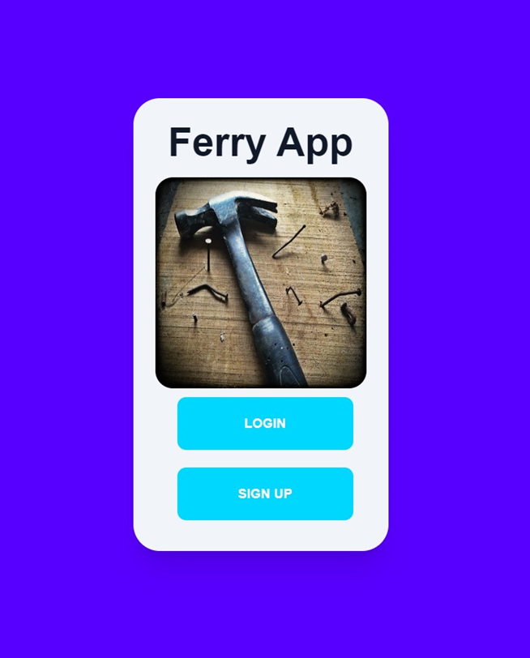

* Si seleccionó el botón Login, usted debe llenar sus datos respectivamente (específicamente hablando de su correo electrónico junto con su contraseña). Si lo llenó correctamente, le aparecerá un mensaje de que pudo ingresar correctamente a la app. En caso de que alguno de los datos fuera erroneo, se le indicará con otro mensaje que cometió un error.

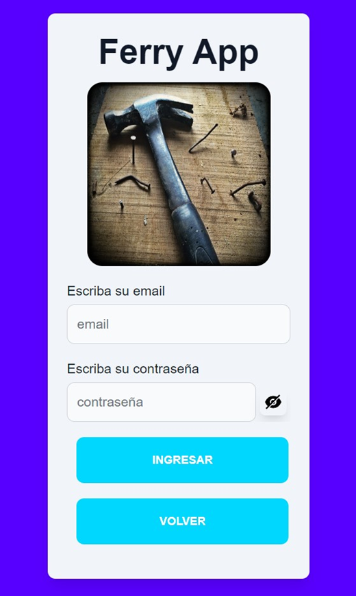

* En caso de haber seleccionado el botón Sign Up, usted deberá de llenar el siguiente formulario correctamente, para lograr registrarse en la aplicación. Si llenó los campos correctamente, le aparecerá un mensaje, el cual le indicará que se registró correctamente, para luego llevarlo a la página anterior. Pero en caso de que algún dato fuese llenado incorrectamente, se le notificará con otro mensaje que campo debe llenarse correctamente.

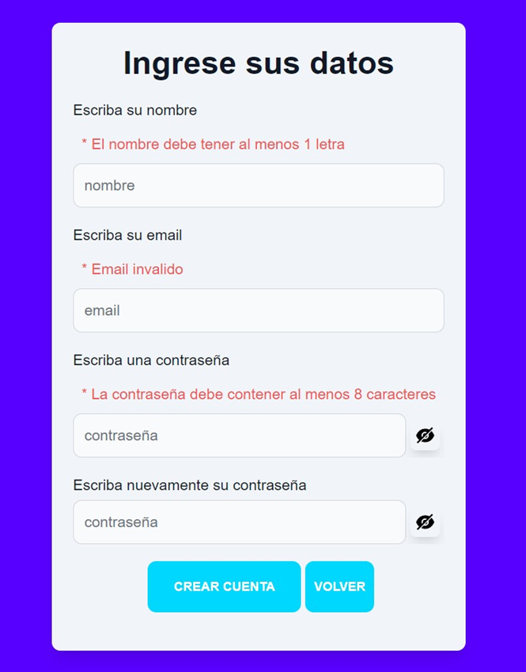

* Cuando logra ingresar a la aplicación, se le aparecerá un menu, el cual tiene a todas las tiendas/locales que se encuentren registrados en la aplicación. Entre las opciones que tiene esta página se encuentran las siguientes:

  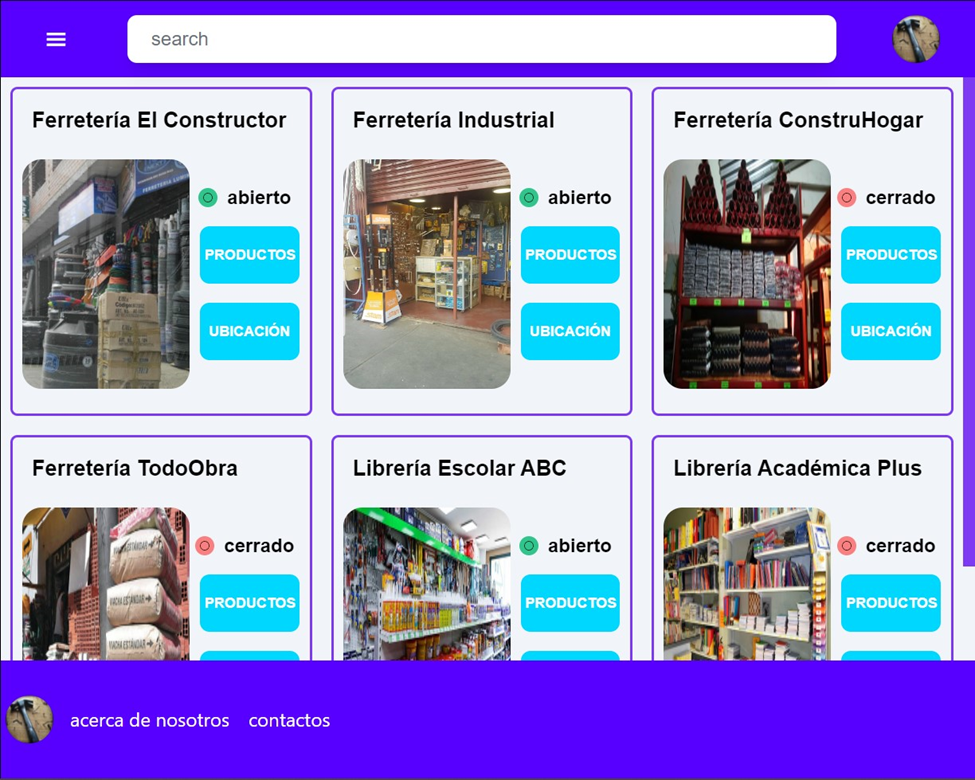

  * Pulsando el botón superior izquierdo, se abrirá una barra de navegación por el mismo lado, el cual mostrará tanto la posibilidad de salir de la aplicación, como la posibilidad de filtrar las tiendas ya sea por su *estado* (abierto o cerrado) o por la *cantidad* de productos que tenga.

  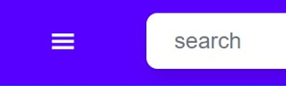

  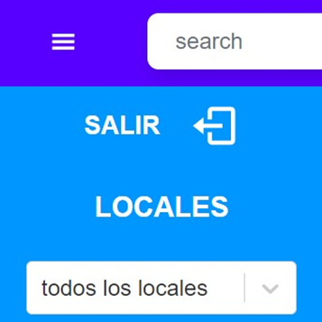

  * Con el buscador, tendrá la capacidad de buscar el local de su interés.

  
 
  * En caso de que desee ingresar a un local para ver sus productos, debe de usar el botón **Productos**.

  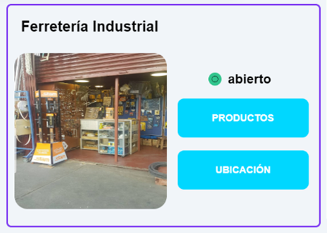

  * Por el contrario, si desea obtener la ubicación sobre donde se encuentra dicha tienda en la ciudad, deberá pulsar el botón **Ubicación**.

  

  * Utilizando el botón **Acerca de Nosotros**, podrá ver una pequeña descripción del objetivo de esta aplicación por medio de un mensaje, para luego tener la posibilidad de cerrarla.

  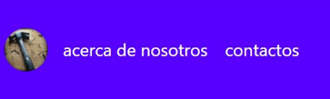

  * Si pulsa el botón **Contactos**, deberá de aparecer la información del desarrollador de esta aplicación por medio de un mensaje, para luego tener la posibilidad de cerrarla.

  

* Si ingresó a una tienda, se le ofrecerá opciones parecidas con la anterior página (como lo es la posibilidad de usar el botón **Acerca de nosotros**, **Contactos** y el **buscador**), sin embargo, algunas de ellas varían, tales como:

  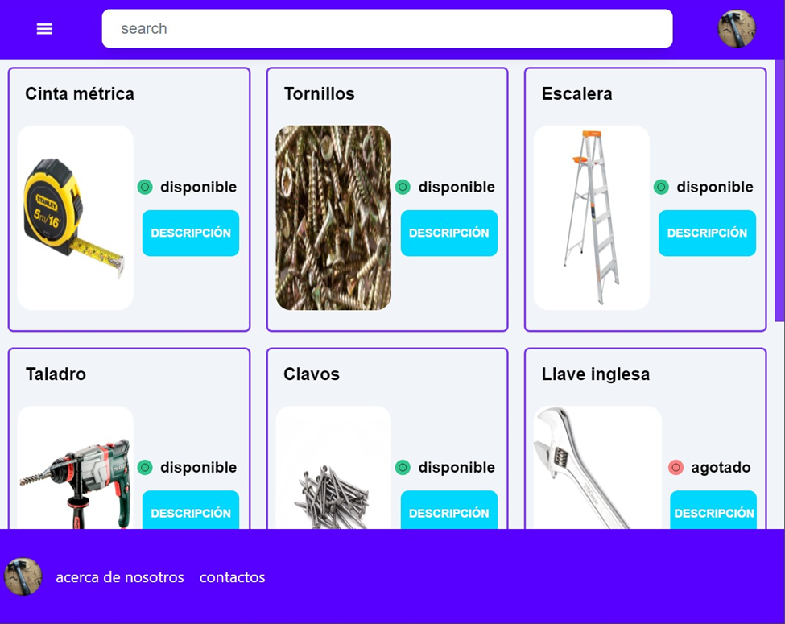

  * Al abrir la opción de desplegar la barra de navegación izquierda, todavía se ofrecerá salir de la aplicación. Sin embargo, la posibilidad de filtrar los productos de la tienda será por *cantidad*, *precio* y *disponibilidad*.

  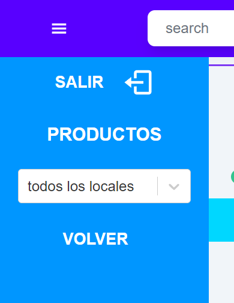

  * También se ofrecerá la posibilidad de leer una descripción del producto, la cual se mostrará por medio de un mensaje si se pulsa el botón **Descripción**

  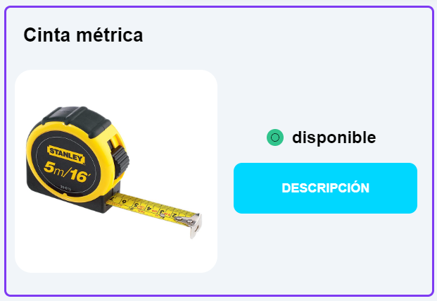

Estas serían todas las funcionalidades que ofrecería la aplicación. Esperamos de que este manual de usuario le haya sido de mucha ayuda.
